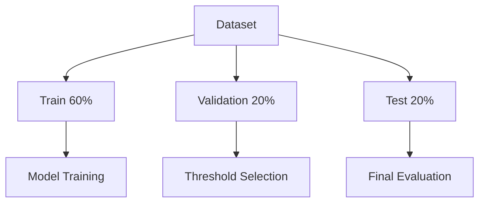

# Dushanbe School Exam Outcome Analysis

Русская версия: [README.ru.md](README.ru.md)

## Overview

This project explores a binary classification workflow for predicting the synthetic exam outcome `Рез_экзамена`. It includes data generation, exploratory analysis, Logistic Regression and CatBoost benchmarks, threshold tuning, model interpretation, and comparison of final test metrics.

Both models use the same feature set and evaluation protocol to support a consistent comparison.

## Important Note About Data

The dataset is entirely synthetic. It does not contain information about real students, teachers, or schools in Dushanbe.

Its distributions and relationships were defined programmatically for educational and portfolio purposes. The results must not be interpreted as evidence about educational quality or student outcomes in Dushanbe.

## Problem Statement

The task is binary classification:

- `1` — the student passes the exam;
- `0` — the student does not pass the exam.

The benchmark evaluates two models:

- Logistic Regression;
- CatBoost.

The decision threshold is selected on a validation set. Final metrics are calculated once on an independent test set.

## Dataset

The generated dataset contains:

- 1,525 observations;
- 15 columns;
- student-level academic, behavioral, psychological, and school-environment variables.

### Target distribution

| Class | Meaning | Observations | Share |
|---|---|---:|---:|
| 0 | Did not pass | 576 | 37.77% |
| 1 | Passed | 949 | 62.23% |

The dataset is stored at:

```text
Data_making/synthetic_education_dushanbe_WITH_ROUNDED.csv
```

The generation logic is available in:

```text
Data_making/synthetic_dushanbe_school_survey.ipynb
```

## Features Used in the Benchmark

Both models use the same 12 features:

1. `Класс`
2. `Район`
3. `Часы_самоподготовки_в_неделю`
4. `Посещаемость_%`
5. `Уверенность_в_себе`
6. `Уровень_стресса_перед_экзаменом`
7. `Пропущенные_дни`
8. `Тип_школы`
9. `Индекс_качества_школы`
10. `Стабильность_преподавателей`
11. `Доступ_к_ресурсам`
12. `Образовательная_среда`

The following columns are excluded:

- `ID_ученика` — an identifier with no intended predictive meaning;
- `Средний_балл` — excluded as a leakage-risk feature because it directly participates in the synthetic target-generation process.

The shared benchmark scenario is recorded as `common_no_avg_grade`.

## Methodology



The evaluation protocol uses:

- a stratified 60%/20%/20% train, validation, and test split;
- `RANDOM_STATE = 42`;
- 915 training observations;
- 305 validation observations;
- 305 test observations;
- the same feature set for both models;
- model fitting on the training set;
- threshold selection on the validation set;
- final evaluation on the independent test set.

The threshold strategy is:

1. Select the threshold that maximizes recall while maintaining precision of at least `0.80` on validation.
2. If no threshold satisfies the precision constraint, select the threshold with the highest validation F1 score.

The fallback was not required for either model.

CatBoost uses the validation set for early stopping and threshold selection. The test set is not used for training, hyperparameter selection, early stopping, or threshold selection.

## Models

### Logistic Regression

The Logistic Regression benchmark uses a scikit-learn pipeline:

- median imputation and standardization for numeric features;
- most-frequent imputation and one-hot encoding for categorical features;
- balanced class weights;
- five-fold stratified cross-validation within the training data;
- threshold selection on validation probabilities.

### CatBoost

The CatBoost benchmark uses:

- native handling of categorical features through `Pool`;
- class weights calculated from the training target only;
- a seeded sample of 20 hyperparameter combinations;
- five-fold stratified CatBoost cross-validation;
- early stopping;
- validation-based threshold selection;
- SHAP analysis on the training set.

## Results

Only metrics calculated on the independent test set are shown.

| Metric | Logistic Regression | CatBoost |
|---|---:|---:|
| Threshold | 0.535 | 0.500 |
| ROC AUC | 0.8250 | 0.8049 |
| PR AUC | 0.8806 | 0.8612 |
| LogLoss | 0.5226 | 0.6667 |
| Accuracy | 0.7311 | 0.7311 |
| Precision | 0.8600 | 0.8506 |
| Recall | 0.6789 | 0.6895 |
| F1 | 0.7588 | 0.7616 |

Logistic Regression has higher ROC AUC, PR AUC, and precision, as well as lower LogLoss. CatBoost has slightly higher recall and F1. Accuracy is equal at the selected thresholds.

These results do not identify a single overall winner. The preferred model depends on whether ranking quality, probability quality, precision, or recall is more important for the intended use case.

Detailed metrics are stored in:

```text
Models/Compare models/logreg_metrics.json
Models/Compare models/catboost_metrics.json
```

## Reproducibility

The project explicitly controls the main sources of randomness:

- `RANDOM_STATE = 42`;
- stratified train, validation, and test splits;
- `np.random.default_rng(42)` for NumPy sampling;
- CatBoost `random_seed = 42`;
- CatBoost CV `partition_random_seed = 42`;
- explicit CV shuffling;
- CatBoost `task_type = "CPU"`;
- fixed dependency versions in `requirements.txt`.

CatBoost reproducibility settings are also recorded in `catboost_metrics.json`.

## Repository Structure

```text
education-quality-dushanbe/
├── Data_making/
│   ├── synthetic_dushanbe_school_survey.ipynb
│   └── synthetic_education_dushanbe_WITH_ROUNDED.csv
├── EDA/
│   └── EDA.ipynb
├── Models/
│   ├── Baseline.ipynb
│   ├── Catboost.ipynb
│   └── Compare models/
│       ├── compare_models.ipynb
│       ├── logreg_metrics.json
│       └── catboost_metrics.json
├── README.md
└── requirements.txt
```

## Installation

Create and activate a virtual environment:

```bash
python3 -m venv .venv
source .venv/bin/activate
```

Install the pinned modeling dependencies:

```bash
python3 -m pip install --upgrade pip
python3 -m pip install -r requirements.txt
```

Install the notebook runtime:

```bash
python3 -m pip install jupyter nbconvert ipykernel
```

Start JupyterLab:

```bash
python3 -m jupyter lab
```

## Reproducing Results

The tracked CSV can be used directly. Run the modeling notebooks in the following order:

```bash
python3 -m jupyter nbconvert \
  --to notebook \
  --execute \
  --inplace \
  --ExecutePreprocessor.timeout=600 \
  Models/Baseline.ipynb
```

```bash
python3 -m jupyter nbconvert \
  --to notebook \
  --execute \
  --inplace \
  --ExecutePreprocessor.timeout=1800 \
  Models/Catboost.ipynb
```

```bash
python3 -m jupyter nbconvert \
  --to notebook \
  --execute \
  --inplace \
  --ExecutePreprocessor.timeout=600 \
  "Models/Compare models/compare_models.ipynb"
```

These commands regenerate the model metric JSON files and the comparison notebook.

To remove stored notebook outputs after execution:

```bash
python3 -m jupyter nbconvert \
  --clear-output \
  --inplace \
  Models/Baseline.ipynb \
  Models/Catboost.ipynb \
  "Models/Compare models/compare_models.ipynb"
```

The synthetic dataset can optionally be regenerated before running the benchmark:

```bash
python3 -m jupyter nbconvert \
  --to notebook \
  --execute \
  --inplace \
  Data_making/synthetic_dushanbe_school_survey.ipynb
```

## Limitations

- The dataset is synthetic and reflects relationships defined by its generator.
- The results do not establish performance on real students or schools.
- Several school-environment variables are derived from related synthetic student-level factors rather than independently measured institutional data.
- The dataset represents only grade 11.
- There is no school-level identifier for group-based validation.
- The benchmark uses one fixed test split of 305 observations.
- Confidence intervals and repeated-split uncertainty estimates are not reported.
- The threshold is optimized for a validation-specific precision constraint and may not transfer to another population.
- The exploratory analysis uses the complete synthetic dataset and is not part of a preregistered modeling protocol.
- Fairness across demographic or institutional groups is not evaluated.
- Probability calibration is not assessed beyond LogLoss.
- The analysis is predictive and does not support causal conclusions.
- Reproducibility is strongest within the pinned CPU environment; minor numerical differences may still occur across platforms or dependency versions.

## Future Work

- Evaluate the workflow on appropriately governed, anonymized educational data.
- Add school-level or temporal validation when suitable identifiers become available.
- Report uncertainty through repeated splits or bootstrap confidence intervals.
- Evaluate probability calibration and threshold stability.
- Add subgroup and fairness analysis.
- Introduce automated data-quality and notebook-execution checks.
- Convert the notebook workflow into a script-based training and evaluation pipeline.
