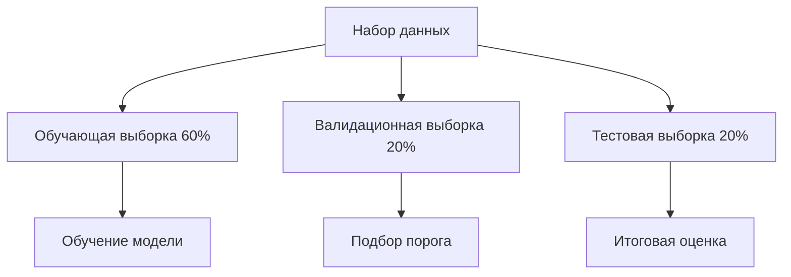

# Анализ результатов школьного экзамена в Душанбе

English version: [README.md](README.md)

## Обзор

Проект исследует процесс бинарной классификации для прогнозирования синтетического результата экзамена `Рез_экзамена`. Он включает генерацию данных, разведочный анализ, бенчмарки Logistic Regression и CatBoost, подбор порога классификации, интерпретацию моделей и сравнение итоговых метрик на тестовой выборке.

Обе модели используют одинаковый набор признаков и единый протокол оценки, что обеспечивает корректное сравнение.

## Важное примечание о данных

Набор данных полностью синтетический. Он не содержит информации о реальных учениках, учителях или школах Душанбе.

Распределения и взаимосвязи в данных заданы программно в учебных целях и для демонстрации проекта в портфолио. Результаты нельзя интерпретировать как свидетельство качества образования или учебных результатов в Душанбе.

## Постановка задачи

Решается задача бинарной классификации:

- `1` — ученик сдал экзамен;
- `0` — ученик не сдал экзамен.

В бенчмарке оцениваются две модели:

- Logistic Regression;
- CatBoost.

Порог принятия решения подбирается на валидационной выборке. Итоговые метрики рассчитываются однократно на независимой тестовой выборке.

## Набор данных

Сгенерированный набор данных содержит:

- 1 525 наблюдений;
- 15 столбцов;
- академические, поведенческие, психологические характеристики учеников и параметры школьной среды.

### Распределение целевой переменной

| Класс | Значение | Наблюдения | Доля |
|---|---|---:|---:|
| 0 | Не сдал | 576 | 37.77% |
| 1 | Сдал | 949 | 62.23% |

Набор данных хранится по адресу:

```text
Data_making/synthetic_education_dushanbe_WITH_ROUNDED.csv
```

Логика генерации доступна в файле:

```text
Data_making/synthetic_dushanbe_school_survey.ipynb
```

## Признаки, используемые в бенчмарке

Обе модели используют одинаковые 12 признаков:

1. `Класс`
2. `Район`
3. `Часы_самоподготовки_в_неделю`
4. `Посещаемость_%`
5. `Уверенность_в_себе`
6. `Уровень_стресса_перед_экзаменом`
7. `Пропущенные_дни`
8. `Тип_школы`
9. `Индекс_качества_школы`
10. `Стабильность_преподавателей`
11. `Доступ_к_ресурсам`
12. `Образовательная_среда`

Исключены следующие столбцы:

- `ID_ученика` — идентификатор, который не должен иметь предсказательной ценности;
- `Средний_балл` — исключён как признак с риском утечки, поскольку непосредственно участвует в процессе генерации синтетической целевой переменной.

Общий сценарий бенчмарка обозначен как `common_no_avg_grade`.

## Методология



Протокол оценки включает:

- стратифицированное разделение на обучающую, валидационную и тестовую выборки в пропорции 60%/20%/20%;
- `RANDOM_STATE = 42`;
- 915 наблюдений в обучающей выборке;
- 305 наблюдений в валидационной выборке;
- 305 наблюдений в тестовой выборке;
- одинаковый набор признаков для обеих моделей;
- обучение моделей на обучающей выборке;
- подбор порога на валидационной выборке;
- итоговую оценку на независимой тестовой выборке.

Стратегия подбора порога:

1. Выбрать порог, который максимизирует Recall при сохранении Precision не ниже `0.80` на валидационной выборке.
2. Если ни один порог не удовлетворяет ограничению по Precision, выбрать порог с наибольшим значением F1 на валидационной выборке.

Резервная стратегия не потребовалась ни для одной из моделей.

CatBoost использует валидационную выборку для early stopping и подбора порога. Тестовая выборка не используется для обучения, подбора гиперпараметров, early stopping или подбора порога.

## Модели

### Logistic Regression

Бенчмарк Logistic Regression использует pipeline scikit-learn:

- заполнение пропусков медианой и стандартизацию числовых признаков;
- заполнение пропусков наиболее частым значением и one-hot encoding категориальных признаков;
- сбалансированные веса классов;
- пятикратную стратифицированную кросс-валидацию внутри обучающей выборки;
- подбор порога по вероятностям на валидационной выборке.

### CatBoost

Бенчмарк CatBoost использует:

- нативную обработку категориальных признаков через `Pool`;
- веса классов, рассчитанные только по целевой переменной обучающей выборки;
- воспроизводимую выборку из 20 комбинаций гиперпараметров;
- пятикратную стратифицированную кросс-валидацию CatBoost;
- early stopping;
- подбор порога на валидационной выборке;
- SHAP-анализ на обучающей выборке.

## Результаты

Показаны только метрики, рассчитанные на независимой тестовой выборке.

| Metric | Logistic Regression | CatBoost |
|---|---:|---:|
| Threshold | 0.535 | 0.500 |
| ROC AUC | 0.8250 | 0.8049 |
| PR AUC | 0.8806 | 0.8612 |
| LogLoss | 0.5226 | 0.6667 |
| Accuracy | 0.7311 | 0.7311 |
| Precision | 0.8600 | 0.8506 |
| Recall | 0.6789 | 0.6895 |
| F1 | 0.7588 | 0.7616 |

Logistic Regression показывает более высокие ROC AUC, PR AUC и Precision, а также более низкий LogLoss. CatBoost показывает немного более высокие Recall и F1. Accuracy при выбранных порогах совпадает.

Эти результаты не позволяют определить единственного абсолютного победителя. Выбор модели зависит от того, что важнее для предполагаемого сценария использования: качество ранжирования, качество вероятностных оценок, Precision или Recall.

Подробные метрики хранятся в файлах:

```text
Models/Compare models/logreg_metrics.json
Models/Compare models/catboost_metrics.json
```

## Воспроизводимость

В проекте явно контролируются основные источники случайности:

- `RANDOM_STATE = 42`;
- стратифицированное разделение на обучающую, валидационную и тестовую выборки;
- `np.random.default_rng(42)` для выборки средствами NumPy;
- `random_seed = 42` для CatBoost;
- `partition_random_seed = 42` для кросс-валидации CatBoost;
- явное перемешивание при кросс-валидации;
- `task_type = "CPU"` для CatBoost;
- фиксированные версии зависимостей в `requirements.txt`.

Параметры воспроизводимости CatBoost также записываются в `catboost_metrics.json`.

## Структура репозитория

```text
education-quality-dushanbe/
├── Data_making/
│   ├── synthetic_dushanbe_school_survey.ipynb
│   └── synthetic_education_dushanbe_WITH_ROUNDED.csv
├── EDA/
│   └── EDA.ipynb
├── Models/
│   ├── Baseline.ipynb
│   ├── Catboost.ipynb
│   └── Compare models/
│       ├── compare_models.ipynb
│       ├── logreg_metrics.json
│       └── catboost_metrics.json
├── README.md
└── requirements.txt
```

## Установка

Создайте и активируйте виртуальное окружение:

```bash
python3 -m venv .venv
source .venv/bin/activate
```

Установите зафиксированные зависимости для моделирования:

```bash
python3 -m pip install --upgrade pip
python3 -m pip install -r requirements.txt
```

Установите среду для работы с ноутбуками:

```bash
python3 -m pip install jupyter nbconvert ipykernel
```

Запустите JupyterLab:

```bash
python3 -m jupyter lab
```

## Воспроизведение результатов

Можно использовать CSV-файл, уже сохранённый в репозитории. Запустите ноутбуки с моделями в следующем порядке:

```bash
python3 -m jupyter nbconvert \
  --to notebook \
  --execute \
  --inplace \
  --ExecutePreprocessor.timeout=600 \
  Models/Baseline.ipynb
```

```bash
python3 -m jupyter nbconvert \
  --to notebook \
  --execute \
  --inplace \
  --ExecutePreprocessor.timeout=1800 \
  Models/Catboost.ipynb
```

```bash
python3 -m jupyter nbconvert \
  --to notebook \
  --execute \
  --inplace \
  --ExecutePreprocessor.timeout=600 \
  "Models/Compare models/compare_models.ipynb"
```

Эти команды заново создают JSON-файлы с метриками моделей и обновляют ноутбук со сравнением.

Чтобы удалить сохранённые результаты выполнения из ноутбуков после запуска:

```bash
python3 -m jupyter nbconvert \
  --clear-output \
  --inplace \
  Models/Baseline.ipynb \
  Models/Catboost.ipynb \
  "Models/Compare models/compare_models.ipynb"
```

При необходимости синтетический набор данных можно заново сгенерировать перед запуском бенчмарка:

```bash
python3 -m jupyter nbconvert \
  --to notebook \
  --execute \
  --inplace \
  Data_making/synthetic_dushanbe_school_survey.ipynb
```

## Ограничения

- Набор данных синтетический и отражает взаимосвязи, заданные его генератором.
- Результаты не подтверждают качество моделей на данных реальных учеников или школ.
- Некоторые параметры школьной среды получены из связанных синтетических характеристик учеников, а не из независимо измеренных институциональных данных.
- Набор данных представляет только 11-й класс.
- Идентификатор школы для групповой валидации отсутствует.
- В бенчмарке используется одна фиксированная тестовая выборка из 305 наблюдений.
- Доверительные интервалы и оценки неопределённости на повторных разбиениях не приводятся.
- Порог оптимизирован под ограничение по Precision на конкретной валидационной выборке и может не переноситься на другую совокупность.
- Разведочный анализ использует весь синтетический набор данных и не является частью заранее зарегистрированного протокола моделирования.
- Справедливость моделей для различных демографических или институциональных групп не оценивалась.
- Калибровка вероятностей отдельно не оценивалась, за исключением LogLoss.
- Анализ является предсказательным и не позволяет делать причинно-следственные выводы.
- Наиболее строгая воспроизводимость обеспечивается в окружении с зафиксированными зависимостями и выполнением на CPU; между платформами или версиями зависимостей возможны небольшие численные различия.

## Дальнейшая работа

- Оценить процесс на должным образом защищённых и анонимизированных образовательных данных.
- Добавить валидацию по школам или времени, когда станут доступны подходящие идентификаторы.
- Оценить неопределённость с помощью повторных разбиений или bootstrap-доверительных интервалов.
- Исследовать калибровку вероятностей и устойчивость порога.
- Добавить анализ подгрупп и справедливости моделей.
- Добавить автоматизированные проверки качества данных и выполнения ноутбуков.
- Преобразовать процесс из ноутбуков в pipeline обучения и оценки на основе скриптов.
